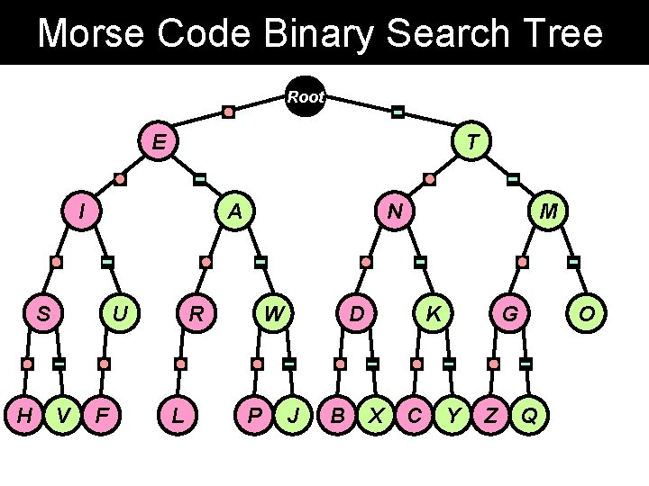

# borse

**borse** is a terminal program meant to practice
reading braille, Morse code, and semaphore,
which are common encodings for
[puzzle hunts](https://web.evanchen.cc/upload/EvanPuzzleCodings.pdf).
Also supports A1Z26 practice.

## Usage

```bash
uvx borse
```

Or you can install from PyPI by using `uv`, `pip`, etc.

## Configuration

Configuration is stored in `~/.config/borse/config.toml` by default, e.g.

```toml
progress_file = "/home/evan/.config/borse/progress.json"
words_per_game = 10
single_letter_probability = 0.3
```

Your daily progress is also automatically saved and displayed on the main menu.

## Hints for memorizing the encodings

Actually this is a note-to-self.

### Remembering braille

For Grade 1 (just the letters `A-Z`),
the chart on [Wikipedia](https://en.wikipedia.org/wiki/English_Braille)
is helpful!
The trick is to memorize just the first 10 symbols for `A-J`,
which only use the upper four dots.
That's because `K-T` are the same as `A-J` with one extra dot,
while `UVXYZ` are `A-E` with one extra dot.

In real life, Grade 2 braille has some additional contractions.
It might be nice to add these into borse at some point.

### Remembering Morse code

In Morse code, the most frequent letters are shorter.
So I think it's a lot easier to remember Morse code as a binary tree,
since the common letters will all be towards the top.
I found [this picture on the Internet](https://slidetodoc.com/binary-trees-binary-tree-structure-root-node-stores/):



I think the dot looks like 0 and a dash looks like a (rotated) 1,
so it makes sense to me that dots are in the left of the tree.

Then you can just memorize the letters in each row in order.
Here are some terrible mnemonics I made up that worked for me
for the first three rows (you're on your own for the last one):

- `ET`: Eastern Time, or a [1982 movie][et]
- `IANM`: I Am Not Mad
- `SURWDKGO`: [SuperUser][su] [ReWrote][rw] [DynamicKernel][dk] in [GO][go]

(Also, `surdwkgo` is also the name of a
[Taiwanese CodeForces grandmaster](https://codeforces.com/profile/surwdkgo).)

[et]: https://en.wikipedia.org/wiki/E.T._the_Extra-Terrestrial
[su]: https://en.wikipedia.org/wiki/Su_(Unix)
[rw]: https://lean-lang.org/doc/reference/latest/Tactic-Proofs/Tactic-Reference/#rw
[dk]: https://en.wikipedia.org/wiki/Dynamic_Kernel_Module_Support
[go]: https://en.wikipedia.org/wiki/Go_(programming_language)

### Remembering semaphore

If you look at a semaphore chart,
what you'll find is that there are some groups of adjacent letters
that just differ in one hand rotating clockwise.
For example, the letters from `A-G` are obtained
by fixing one arm at 6 o'clock and rotating the other arm
all the way from 7:30 to 4:30.

So in my head, I organize the letters in "blocks",
where each block starts with two arms at a 45-degree angle,
and then having the other arm rotate clockwise.
The resulting blocks are then easier to remember:

- **A block**: `ABCDEFG`
- **H block**: `HIKLMN` (note `J` is missing)
- **O block**: `OPQRS`
- **T block**: `TUY` (note the additional `Y`)
- **# block**: `#JV` (this is the weird exceptions one)
- **W block**: `WX`
- **Z block**: `Z`

I don't know if `A HOT #WZ` means anything to you.

## Development

Set up by cloning the repository and running

```bash
uv sync
uv run prek install
```

To manually run the linter and tests

```bash
uv run prek --all-files # run linter
uv run prek --all-files --hook-stage pre-push
```

## FAQ

- _Where does the name come from?_

  From `Braille mORse SEmaphore`.

- _Should "braille" be capitalized?_

  [No](https://www.brailleauthority.org/capitalization/capitalization.html).

- _Why would you spend time learning this?_

  It could be a great conversation starter for a first date…
